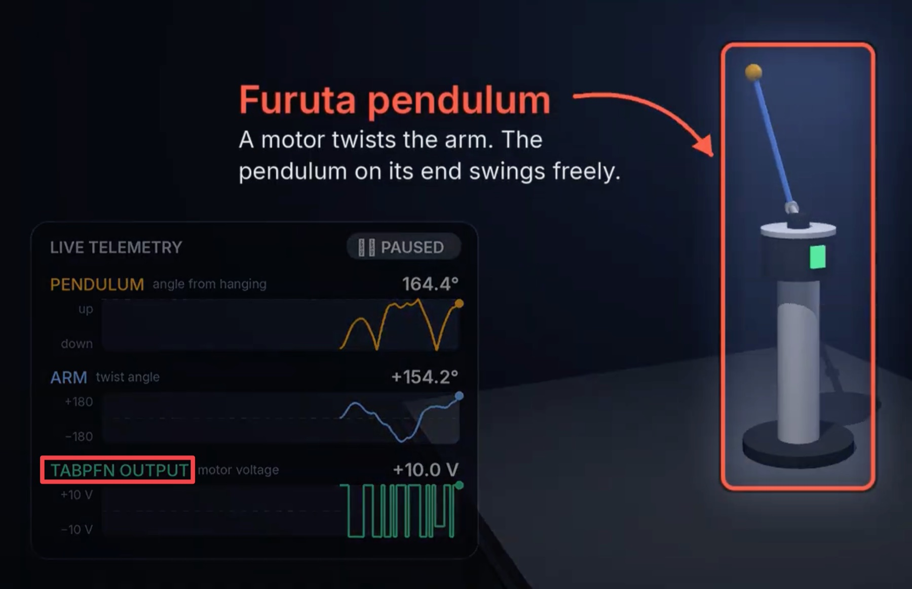
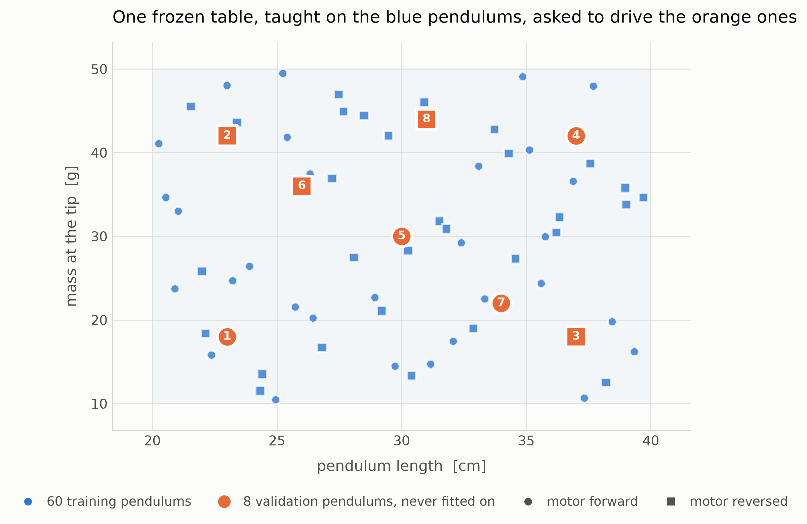
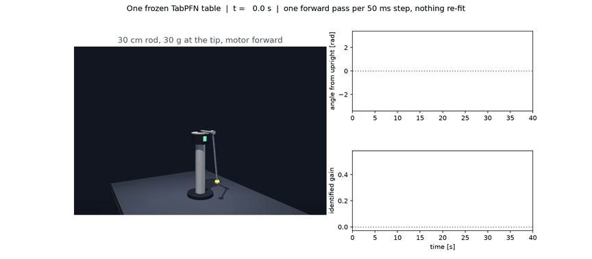

# TabPFN interpolates a feedback policy at run time



<h3 align="center"><a href="https://youtu.be/l5mC2UcjS9I">▶️ Watch the Video Summary</a></h3>

A frozen [TabPFN-3.5](https://github.com/PriorLabs/TabPFN) classifier swings up and balances Furuta
pendulums it has never seen. The pendulums differ in length, tip mass and motor direction, and the
model is never told which one it is driving. Each query row carries ten numbers summarising the last
second of motion, and TabPFN works out the pendulum from them in-context.

Nothing is re-fit and no gradient step is taken. There is no linear controller or planner in the
loop, just one TabPFN forward pass per 50 ms control step.

---

## Results

The context table was built from planner demonstrations on 60 pendulums and then frozen. It is
tested on eight new pendulums that lie **inside** the range of the training ones, so the claim is
interpolation, not extrapolation.



These eight were never in the training data, but some data-collection choices were tuned by
watching them, so they are a validation set. The clean test set is the twelve random pendulums
further down.

Each pendulum is run with four seeds and counts only if it swings up and stays up to the end of
every run.

| # | pendulum | motor | swings up and holds | time to upright | RMS when up |
|---|---|---|---|---|---|
| 1 | 23 cm, 18 g | forward | **4 / 4** | 1.0–2.5 s | 0.020 rad |
| 2 | 23 cm, 42 g | reversed | **4 / 4** | 1.0–1.6 s | 0.011 rad |
| 3 | 37 cm, 18 g | reversed | **4 / 4** | 0.5–4.7 s | 0.015 rad |
| 4 | 37 cm, 42 g | forward | **4 / 4** | 1.7–18.8 s | 0.047 rad |
| 5 | 30 cm, 30 g | forward | **4 / 4** | 1.9–9.3 s | 0.015 rad |
| 6 | 26 cm, 36 g | reversed | **4 / 4** | 1.2–2.4 s | 0.016 rad |
| 7 | 34 cm, 22 g | forward | **4 / 4** | 0.5–6.0 s | 0.018 rad |
| 8 | 31 cm, 44 g | reversed | **4 / 4** | 1.2–3.1 s | 0.016 rad |

**32 of 32 episodes.** With the ten history columns zeroed, the same table manages only 10 of 32:

| condition | motor forward | motor reversed |
|---|---|---|
| **rolling history** | **16 / 16** | **16 / 16** |
| history columns zeroed | 10 / 16 | **0 / 16** |

Without the history, the policy collapses onto a *single* control direction. It still works on 10
of the 16 forward-wired episodes, but on none of the 16 reversed ones. The history columns are what
tell it which pendulum, and which motor direction, it is driving.

**The clean test set.** Twelve random pendulums, drawn after every choice above was made, show the
same pattern: 12 of 12 with the history, 4 of 12 without it, and 0 of 6 on reversed motors.

A TabPFN call takes a median 50 ms on an idle twelve-core CPU, right at the 50 ms budget. Pendulum
4, the longest and heaviest, is the hardest: it always gets up, but once took 18.8 s, and its
balance error is about three times that of the others.

### Watch it

Forty seconds, one frozen table, four disturbances, nothing re-fit.



| at | what happens to the pendulum | back upright after |
|---|---|---|
| 8 s | pushed | 1.0 s |
| 14 s | **motor polarity reversed** | 3.7 s |
| 24 s | pushed again | 1.0 s |
| 30 s | swapped for a different pendulum entirely | 1.2 s |

The full-resolution clip of the same run is [`media/demo.mp4`](media/demo.mp4) (1920x840, 60 fps).

### Run the demo yourself

```bash
python scripts/demo.py --viewer       # native MuJoCo window
mjpython scripts/demo.py --viewer     # on macOS, where the window must own the main thread
python scripts/demo.py --web          # browser instead; needs no local display or GL
```

The demo needs only `data/policy_table.npz`, which is committed, so it runs on a fresh clone.

Six clickable plates on the table change the rig while it runs. Nothing is re-fit.

| plate | what it does | what you see |
|---|---|---|
| **switch plants** | steps through the eight validation pendulums above | the rod changes length, the bob resizes |
| reverse motor | flips the motor polarity | the housing and its tell-tale turn red |
| random pendulum | draws a fresh length and tip mass | the rod changes length, the bob resizes |
| drop to hanging | resets and clears the history window | |
| dither on/off | removes the exploration voltage | the identified gain decays to nonsense |
| push left / right | a 0.3 N m kick | |

**Press `switch plants`** to watch the frozen table drive each validation pendulum in turn. An
overlay shows the plant, the identified motor gain, whether the policy is swinging up or balancing,
and how long each TabPFN call takes. To grab the pendulum, double-click it, then ctrl-drag.

---

## Methods

How the table is built, why the history is a ridge-regression statistic rather than raw lags, and
what is deliberately not claimed: **→ [docs/methods.md](docs/methods.md)**

One control step, every 50 ms:

```text
┌─▶ Furuta pendulum (MuJoCo). Its length, tip mass and motor direction are hidden.
│      │
│      ├── state now ───────────▶  6 columns  cos α, sin α, α̇, φ̇, α̇·cos α, Ẽ
│      │
│      └── last 20 steps (1 s) ─▶ 10 columns  ridge fit of Δα̇, Δφ̇ on [1, u, α̇, φ̇, sin α]
│                                      │
│                                      ▼  together, one 16-column query row
│   ┌────────────────────────┬────────────────────┬─────────┐
│   │ state + pumping (6)    │ history (10)       │ voltage │
│   ├────────────────────────┼────────────────────┼─────────┤
│   │ ...                    │ ...                │  +4 V   │  context: 8,000 rows
│   │ ...                    │ ...                │  −0.3 V │  of demonstrations on
│   │ ...                    │ ...                │  +10 V  │  60 pendulums, frozen
│   ├────────────────────────┼────────────────────┼─────────┤
│   │ now                    │ last second        │    ?    │  ◀── query row
│   └────────────────────────┴────────────────────┴─────────┘
│                                      │
│                                      ▼
│               TabPFNClassifier: one forward pass, nothing re-fit
│                                      │
│                                      ▼  a probability for each of 15 voltage classes
│     −10  −6  −4  −2.5  −1.5  −0.8  −0.3  0  +0.3  +0.8  +1.5  +2.5  +4  +6  +10 V
│      ·    ·   ·    ·     ·     ▂     █   ▄    ▁     ·     ·     ·    ·   ·   ·    e.g.
│                                      │
│                                      ▼  argmax, plus a small exploration dither
└──────────────────────────── u, held on the motor for the next 50 ms
```

The ten history columns are a local linear model of whichever pendulum is attached, refitted every
step in microseconds; TabPFN supplies the nonlinear control law on top of it. The two pumping
columns use one **fixed reference pendulum**, never the real one, so no plant parameter leaks into
the model, and a test checks this.

Two findings from the methods:

- [Seven columns of summary statistics beat 105 columns of raw lags](docs/methods.md#why-that-history-encoding),
  and every raw-lag encoding past two lags is worse than no history at all.
- [The history really does system identification](docs/methods.md#the-statistic-really-is-system-identification).
  From one second of data it recovers the motor direction 99 % of the time, the length at r = 0.60,
  and the tip mass at only r = 0.37. That is why zeroing it breaks the reversed motors: direction
  is the thing it knew for certain.

---

## Reproduction

Installation, regenerating everything from scratch, and troubleshooting:
**→ [docs/reproduction.md](docs/reproduction.md)**

Everything slow to produce is committed (demonstrations, excitation data, the policy table, results
and media), so a fresh clone reproduces the figures and the demo without re-running it.
`requirements.lock` pins the exact versions the numbers came from. Everything was tested on
Ubuntu 26.04 LTS.

Only TabPFN's weights are not committed: about 1.2 GB, licensed, and downloaded on first use with a
Prior Labs token. After that, everything runs offline.

```bash
uv venv --python 3.14
uv pip install -r requirements.lock && uv pip install -e . --no-deps
export TABPFN_TOKEN=...                                # first run only
pytest -q                                              # 14 tests, ~2 s, no TabPFN needed
python scripts/evaluate.py --test-plants --seeds 4     # the headline table, ~25 min
```

Regenerating everything from scratch takes about two and a half hours.

### Layout

| path | what |
|---|---|
| `src/tabpfn_control/envs.py`, `mujoco_env.py` | the Furuta pendulum: a hand-derived Lagrangian model and a MuJoCo twin that agrees with it to 5 % |
| `src/tabpfn_control/history.py` | the five history encodings, used identically offline and online |
| `src/tabpfn_control/policy.py` | the frozen policy: features, table building, one TabPFN call per step |
| `src/tabpfn_control/teacher.py`, `planners.py`, `lqr.py` | the plant family and the MPPI + LQR teacher, used only to collect data |
| `src/tabpfn_control/model.py` | TabPFN as a dynamics model, used by the encoding sweep |
| `scripts/` | generate data, train, evaluate, demo, make the figure, make the walkthrough video |
| `data/` | demonstrations, excitation data, and the policy table that *is* the model |
| `results/` | every number quoted here, as written by the command that produced it |
| `tests/` | 14 tests, including that run-time geometry matches a freshly compiled model and that the energy feature cannot leak the plant |

---

## Credits

**[TabPFN-3.5](https://github.com/PriorLabs/TabPFN)** by [Prior Labs](https://priorlabs.ai) is the
frozen tabular foundation model that does all of the control here.

## Licence

Apache-2.0, see [LICENSE.md](LICENSE.md). This covers the code and the generated data in this
repository, not the TabPFN weights, which carry Prior Labs' own licence.
